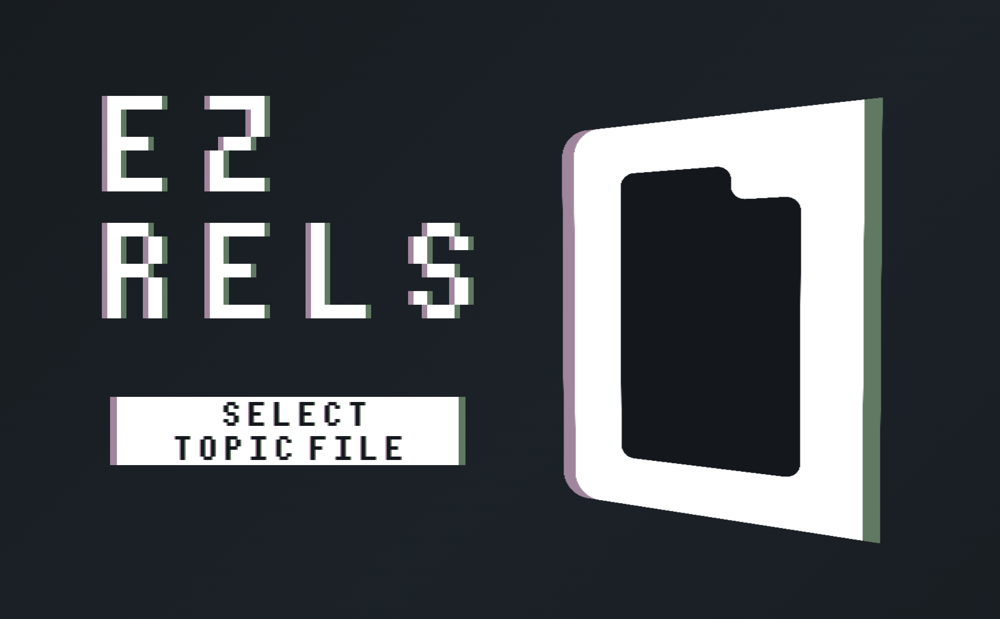

# EZRels - TREC Qrels Generator

An Electron app for generating TREC-style qrels files from topic documents.



## Installation

```bash
npm install
```

## Running

```bash
npm start
```

## Usage

1. Launch the app
2. Select a topics file (must follow the specified format with topic_no, topic_title, topic_desc, topic_narrative, and documents)
   - Supports both plain text and gzipped (.gz) files
3. (Optional) Load existing qrels file to continue previous work
4. Navigate through topics and documents using the navigation buttons
5. Mark documents as relevant or not relevant using the checkbox
6. Click "Produce Qrels" to save the qrels file

## Features

- **Autosave**: Automatically saves progress to `autosave/` folder when you navigate to the next document
- **Load Progress**: Load existing qrels files to continue previous work
- **Gzip Support**: Automatically decompresses .gz files
- **Validation**: Warns if loaded qrels file doesn't fully match current topics/documents

## Topics File Format

The input topics file must follow this format:

```
<topic_no>
001
</topic_no>
<topic_title>
spongebob
</topic_title>
<topic_desc>
Find information related to the television series
"SpongeBob SquarePants."
</topic_desc>
<topic_narrative>
A relevant document will discuss the television show...
</topic_narrative>
[document 1]
[document 2]
...
[document k]
```

**Important Notes:**
- Each document must be separated by a `</document>` tag
- Each document's first line should contain `docno: [document-id]`
- The file can be plain text or gzipped (.gz)
- [Example topics file](https://drive.google.com/file/d/10crJLQm_0vulkSD1J0IFgqBHVyXHoLol/view?usp=sharing)

## Output Format

The app produces a TREC-style qrels file with the format:
```
topic_no iteration doc_no relevance
```

Where:
- topic_no: Topic number from the input file
- iteration: Always 0
- doc_no: Document number extracted from "docno:" line
- relevance: 1 for relevant, 0 for not relevant

